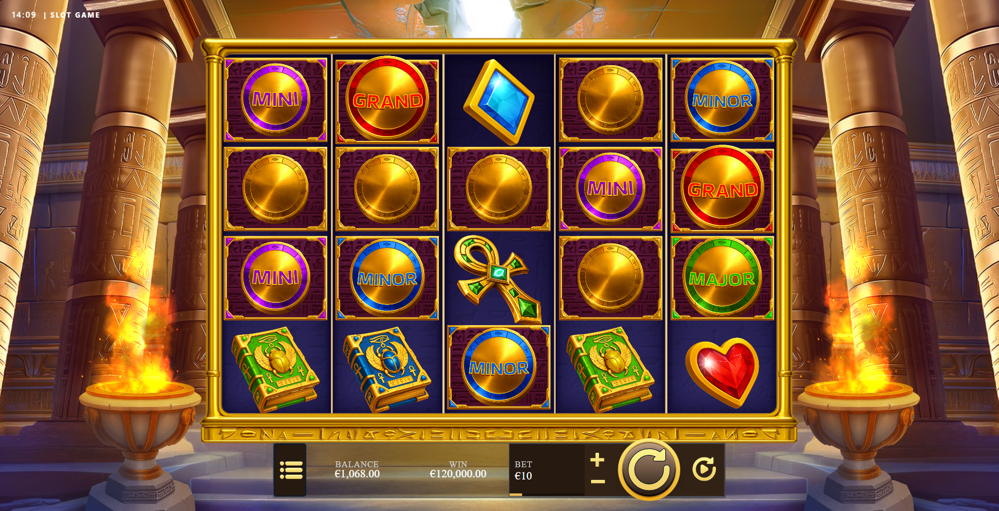

# Advanced Slot Game

A production-grade HTML5 slot game built with [PixiJS v8](https://pixijs.com/) and [GSAP](https://gsap.com/), developed as a portfolio project to demonstrate advanced game architecture, real-time animation systems, and casino-grade spin mechanics.

> **Note:** This project exists purely to display technical skills and architectural knowledge. It is **not fully finished or polished** — visual assets, UI elements, and some features are intentionally left in an incomplete state. The goal is to showcase the engineering approach, not to deliver a shippable product.

---

## Demo



> For a full video preview, visit [xhulianomalaj.dev](https://xhulianomalaj.dev) under the **Projects** section.

---

## Overview

This game is a standalone client module. It is not a self-contained application — it is designed to be **loaded and controlled by a launcher shell** that manages the game lifecycle, communicates with an operator backend, and renders the surrounding UI (balance display, spin button, win animations, etc.).

This architecture mirrors how real casino games are deployed in the industry: the game is a sandboxed module; the operator (casino) controls everything around it.

---

## How It Works

```
┌─────────────────────────────────────────────────────┐
│                   Casino Operator                    │
│              (backend / RGS server)                  │
└────────────────────────┬────────────────────────────┘
                         │ spin results, balance, config
                         ▼
┌─────────────────────────────────────────────────────┐
│                  Slot Launcher                       │
│   Angular shell — loads game bundle dynamically,     │
│   renders UI, manages operator communication         │
└────────────────────────┬────────────────────────────┘
                         │ mount / init / spin events
                         ▼
┌─────────────────────────────────────────────────────┐
│              Advanced Slot Game  (this repo)         │
│   PixiJS canvas — reels, symbols, animations,        │
│   win sequences, anticipation, audio                 │
└─────────────────────────────────────────────────────┘
```

The launcher and engine framework live in a **private repository** and are published as scoped npm packages under `@dreams-engine/*`. This game consumes them as regular npm dependencies.

---

## Tech Stack

| Layer | Technology |
|---|---|
| Rendering | PixiJS v8 |
| Animations | GSAP 3 + Spine (skeletal animation) |
| Game logic / state | XState v5 (finite state machines) |
| Language | TypeScript |
| Bundler | Vite |
| Package manager | pnpm |

---

## Features

- **Multiple spin behavior presets** — Standard, Strip (continuous-strip), and Fall (cascade drop), switchable per build
- **Anticipation system** — Reel slowdown/hold effect when bonus symbols are close to landing
- **Spine skeletal animations** — Symbol win animations, idle states, scatter wins
- **Responsive layout** — Portrait and landscape support with configurable scale modes
- **Audio system** — Positional and layered audio managed by the engine
- **Localization** — i18next integration for multi-language support

---

## Running Locally

Running this game locally requires access to the private `slot-engine` repository, which contains the launcher shell and mock server. The game bundle has no standalone entry point — it must be bootstrapped by the launcher.

Access to the engine repository may be made available in the future. If you are interested, feel free to reach out.

---

## Project Structure

```
src/
  bootstrap.ts      # Engine init, plugin registration, app lifecycle
  index.ts          # Public module exports
  presenters.ts     # Win presentation logic (connects state machine → visuals)
  scenes/
    Background.ts   # Background scene
    Main.ts         # Core slot machine setup — reels, symbols, machine config
    Welcome.ts      # Preload / intro scene
public/             # Static assets served at dev time
raw-assets/         # Source assets processed by AssetPack into public/assets
```

---

## Dependencies

All engine dependencies are published to npm under the `@dreams-engine` scope (private organisation):

| Package | Description |
|---|---|
| `@dreams-engine/engine` | PixiJS application framework, plugin system, navigation |
| `@dreams-engine/slot` | Slot machine, reels, spin behaviors, anticipation |
| `@dreams-engine/slot-flow` | Command/runner pattern for game flow, win presentation |
| `@dreams-engine/slot-state` | XState finite state machines for spin and bonus flows |
| `@dreams-engine/common` | Shared TypeScript configs and build scripts |
